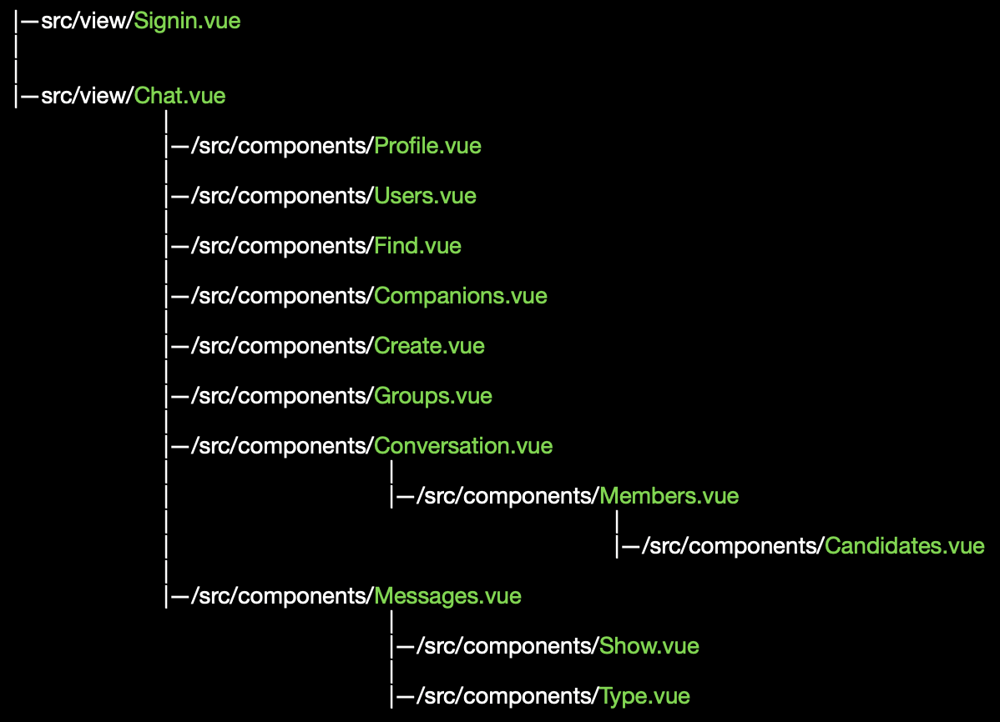

# NOGRAM - Modern Messaging Platform

Welcome to Nogram! A modern messaging platform that lets you connect with others in a simple and intuitive way.

## Prerequisites

You'll need Docker installed on your computer:

- [Docker Desktop for Mac](https://www.docker.com/products/docker-desktop/)
- [Docker Desktop for Windows](https://www.docker.com/products/docker-desktop/)
- [Docker for Linux](https://docs.docker.com/desktop/install/linux-install/)

## Getting Started

1. Clone this repository
2. Run `./start.sh`
3. Enjoy! 🎉

Want a fresh start? Just run `./reset.sh`

That's it! Happy messaging! 💬

---

*Note: This project is for educational purposes.*

<h1>Structure of vue components</h1> 
 
<h1>Role of each component in this tree</h1> 
 
<h1>Communication of client and server</h1> 
 
 
<h1>Database</h1> 
 
